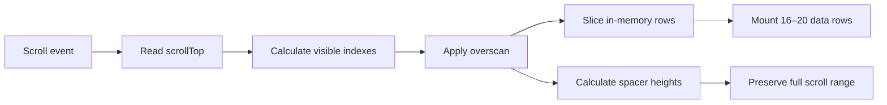

# AxiomGrid — 100K-Row Virtualized Data Grid

> A high-performance React and TypeScript data grid that manages 100,000 records while mounting only the rows visible inside the scroll viewport.

**Live demo:** [Open AxiomGrid](https://react-100k-virtualized-data-grid.vercel.app/)

## Project overview

AxiomGrid is an in-memory workforce data grid built to demonstrate row virtualization at a 100,000-record scale. It generates a stable employee dataset, exposes typed and immutable CRUD operations, supports client-side search, and renders a small moving window of table rows instead of mounting the complete dataset in the DOM.

This repository currently represents the virtualized-grid foundation. The more advanced data-grid capabilities listed in the [Roadmap](#roadmap) are planned, not implemented.

## Engineering problem

Rendering one `<tr>` for every record makes DOM size and React reconciliation grow with the dataset. AxiomGrid keeps all 100,000 `EmployeeRow` objects available in React memory but renders only the portion intersecting the viewport, plus a small overscan buffer.

With the current configuration, 12 rows are visible and four rows are overscanned in each direction. That means approximately 16 data rows are mounted near the top or bottom and 20 in the middle, rather than 100,000. Header and spacer rows are additional structural `<tr>` elements.

## How the virtualization engine works

The grid uses a fixed row height of 48 px, a 576 px data viewport, and an overscan of four rows.

1. The scroll container reports `scrollTop` whenever it scrolls.
2. `scrollTop` is clamped to the valid scroll range.
3. The first visible index is `floor(scrollTop / rowHeight)`.
4. The exclusive visible end index is calculated from `(scrollTop + viewportHeight) / rowHeight`.
5. Overscan expands the range before and after the visible indexes, within dataset bounds.
6. The grid slices `visibleRows` to that range and mounts only the resulting records.
7. Top and bottom spacer heights preserve the full scrollable height:
   - `topSpacerHeight = startIndex * rowHeight`
   - `bottomSpacerHeight = (rowCount - endIndexExclusive) * rowHeight`



## Implemented features

- Deterministic generation of 100,000 employee records using a seeded PRNG
- Fixed-height row virtualization with bounded ranges and overscan
- Top and bottom spacer rows that preserve native scrolling
- Typed column definitions with accessors, widths, and alignment
- In-memory search across every displayed employee field
- Add, read, update, and delete operations
- Form validation for employee creation and editing
- Typed CRUD errors for invalid IDs, duplicates, missing rows, capacity, and insertion rules
- Immutable writes: add, update, and delete return new arrays without changing their inputs
- Insert-at-start, insert-at-end, indexed, and anchor-relative row insertion APIs
- Workforce summary cards for totals, active employees, average performance, and payroll
- Sticky table header, formatted values, horizontal overflow, and explicit empty-search messaging

## Architecture and folder structure

```text
axiom-grid/
├── public/
│   └── og.png
├── src/
│   ├── app/
│   │   ├── globals.css
│   │   ├── layout.tsx
│   │   └── page.tsx
│   └── features/
│       └── grid/
│           ├── components/
│           │   ├── add-row-form.tsx
│           │   ├── data-grid.tsx
│           │   ├── edit-row-form.tsx
│           │   ├── grid-workspace.tsx
│           │   └── search-bar.tsx
│           ├── config/
│           │   └── employee-columns.ts
│           ├── context/
│           │   └── grid-context.tsx
│           ├── data/
│           │   ├── generate-rows.test.ts
│           │   └── generate-rows.ts
│           ├── engine/
│           │   ├── grid-engine.ts
│           │   ├── row-operations.test.ts
│           │   ├── row-operations.ts
│           │   ├── virtualization.test.ts
│           │   └── virtualization.ts
│           └── model/
│               └── grid.types.ts
├── eslint.config.mjs
├── next.config.ts
├── package.json
├── postcss.config.mjs
└── tsconfig.json
```

`GridWorkspace` owns the canonical row array. `GridProvider` exposes rows, filtered rows, columns, search state, and CRUD actions. The engine modules remain framework-independent, while `DataGrid` connects scroll state to the virtualization range and table rendering.

## Technology stack

- Next.js 16.2.12
- React 19.2.4
- TypeScript 5
- Tailwind CSS 4
- Node.js built-in test runner
- ESLint 9 with Next.js Core Web Vitals and TypeScript rules

## Getting started

Use the hosted application at [react-100k-virtualized-data-grid.vercel.app](https://react-100k-virtualized-data-grid.vercel.app/), or run it locally:

```bash
git clone https://github.com/abdulwahabkhn/react-100k-virtualized-data-grid.git
cd react-100k-virtualized-data-grid
npm install
npm run dev
```

Open [http://localhost:3000](http://localhost:3000).

## Available commands

| Command | Purpose |
| --- | --- |
| `npm run dev` | Start the development server |
| `npm run build` | Create a production build |
| `npm run start` | Serve the production build |
| `npm run lint` | Run ESLint |

There is currently no `npm test` or dedicated type-check script. Use these commands directly:

```bash
npx tsc --noEmit
node --experimental-transform-types --test src/features/grid/data/generate-rows.test.ts src/features/grid/engine/row-operations.test.ts src/features/grid/engine/virtualization.test.ts
```

The test command uses Node's TypeScript transform mode because the source includes TypeScript syntax that strip-only mode does not support.

## Testing strategy

The repository contains 29 passing unit tests:

- 7 row-generator tests: count, ID uniqueness, seed determinism, field constraints, and invalid counts
- 15 CRUD tests: insertion positions, duplicates, limits, reads, immutable updates, immutable deletes, and typed failures
- 7 virtualization tests: empty data, top/middle/bottom ranges, partial rows, short datasets, clamping, spacers, and invalid inputs

UI component tests, end-to-end tests, and tests for `grid-engine.ts` are not implemented yet.

## Performance verification

Verified structurally and through unit tests:

- The default generator creates exactly 100,000 unique employee and row IDs.
- The virtual range mounts approximately 16–20 data rows for the current 12-row viewport and four-row overscan.
- Spacer calculations preserve the logical height of the complete dataset.

Browser frame timings, memory usage, interaction latency, React Profiler results, and Lighthouse scores: **Not measured yet.**

## Current limitations

- All records live in browser memory and reset on refresh; there is no persistence or server-backed data source.
- Search is synchronous and scans the in-memory dataset on the main thread.
- Rows must have a fixed height for the current range calculation.
- Sorting, column interaction, selection, keyboard navigation, batch editing, and undo/redo are not implemented.
- Accessibility foundations exist, but a complete grid interaction model and accessibility audit are still pending.
- There is no Storybook, automated browser test suite, or recorded performance profile.

## Roadmap

- Column resizing, reordering, freezing, and hide/show controls
- Sorting and richer filtering backed by Web Workers
- Row and cell selection with keyboard navigation
- Advanced validation, batch editing, and undo/redo
- Loading, empty, error, and theme states
- Accessibility hardening and responsive-design refinement
- Component and end-to-end testing
- React/browser performance profiling
- Storybook documentation and isolated component scenarios

## Technical decisions

- **Keep data and DOM scale separate.** The full array remains queryable in memory while rendering cost follows viewport size.
- **Use fixed row heights.** A constant height makes index and spacer calculations deterministic and inexpensive.
- **Overscan adjacent rows.** Four rows on each side reduce visible mounting churn during scrolling.
- **Preserve native scrolling.** Spacer rows represent unmounted content without replacing the browser's scroll model.
- **Generate deterministic fixtures.** The same count and seed produce the same records, making tests and debugging repeatable.
- **Centralize mutations.** Context routes state changes through pure CRUD functions and commits their returned arrays.
- **Protect identity.** Updates cannot change row IDs, and duplicate or missing IDs produce typed errors.
- **Keep the engine framework-independent.** Generation, virtualization, formatting, search, summaries, and row operations are separated from React components.

## Author

**Abdul Wahab Khan**

- GitHub: [@abdulwahabkhn](https://github.com/abdulwahabkhn)
- Repository: [react-100k-virtualized-data-grid](https://github.com/abdulwahabkhn/react-100k-virtualized-data-grid)
- Live demo: [react-100k-virtualized-data-grid.vercel.app](https://react-100k-virtualized-data-grid.vercel.app/)

## License

No license file is currently included. Until a license is added, the repository has no explicit open-source license.
